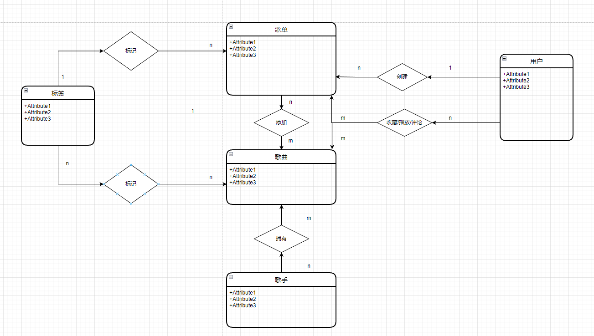

# 项目：音乐播放网站

# 文件夹说明

`back`   后端项目代码

`front`  前端项目代码

`db`      `mysql`数据库的`.sql`文件

# 项目简介

仿写QQ音乐网站。

# 预计实现功能

1. 实现**歌曲**的播放、收藏与评论等功能。
2. 实现**歌单**的增删改查以及播放、收藏与评论等功能。
3. 实现用户个人信息的增删改查以及查看听歌历史记录的功能。
4. 实现歌单的智能化推荐功能。

# 技术栈

前端：Vue2.0 、Element UI 、moment、Axios

后端：SpringBoot 、Spring Security、Spring Task、Mybatis-Plus 、RabbitMQ、Jwt

数据库：MySql、Redis、MongoDb

接口：swagger

# 目前已实现：

1. 只剩下评论相关的功能未实现

# 项目的实体关系（简略版）

- 注：收藏、播放、评论等多对多关系转移到了MongoDb进行存储